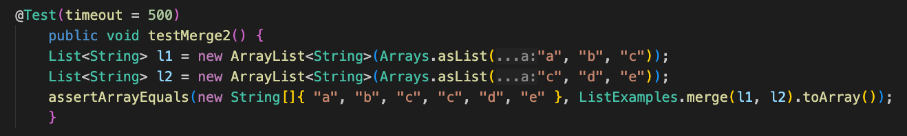
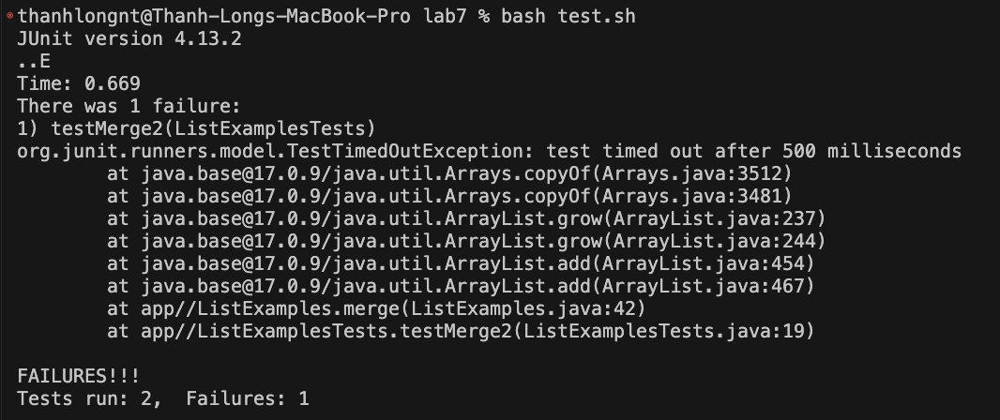
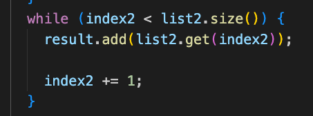
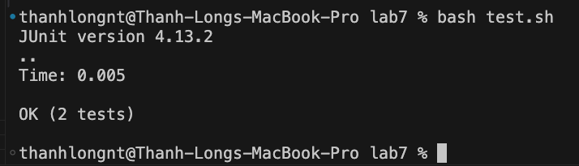

# Lab Report 5

## Part 1
Student: Hello! I am having trouble with my 'merge' method that takes in two lists and merges them in a sorted order, but when I test it using bash test.sh, it always fails and produces the wrong output, and I can't find the reason why. and I was wondering if I could get some help.

Here are screenshots of my buggy code, failed test code, and the failed tests output:




TA: Hello! Have you checked that all of your variables are properly named and that there are no typos? 

Student: I just checked them and it turns out that in the last while loop on line 44 I typed index1 instead of index2. I was able to fix it and my tests work. Thank you so much!




Set up Info:
Directory structure:
```
thanhlongnt@Thanh-Longs-MacBook-Pro lab7 % ls
ListExamples.class      ListExamplesTests.class StringChecker.class     test.sh
ListExamples.java       ListExamplesTests.java  lib
```
(lib is a directory)

Content of ListExamples.java before fixing bug:
```
import java.util.ArrayList;
import java.util.List;

interface StringChecker {
  boolean checkString(String s);
}

class ListExamples {

  // Returns a new list that has all the elements of the input list for which
  // the StringChecker returns true, and not the elements that return false, in
  // the same order they appeared in the input list;
  static List<String> filter(List<String> list, StringChecker sc) {
    List<String> result = new ArrayList<>();
    for (String s : list) {
      if (sc.checkString(s)) {
        result.add(0, s);
      }
    }
    return result;
  }

  // Takes two sorted list of strings (so "a" appears before "b" and so on),
  // and return a new list that has all the strings in both list in sorted order.
  static List<String> merge(List<String> list1, List<String> list2) {
    List<String> result = new ArrayList<>();
    int index1 = 0, index2 = 0;
    while (index1 < list1.size() && index2 < list2.size()) {
      if (list1.get(index1).compareTo(list2.get(index2)) < 0) {
        result.add(list1.get(index1));
        index1 += 1;
      } else {
        result.add(list2.get(index2));
        index2 += 1;
      }
    }
    while (index1 < list1.size()) {
      result.add(list1.get(index1));
      index1 += 1;
    }
    while (index2 < list2.size()) {
      result.add(list2.get(index2));
      
      index1 += 1;
    }
    return result;
  }

}
```

Command line ran to trigger bug:

What edit was needed to fix the bug:


## Part 2: What I learned 2nd half of quarter
  The main new thing that I learned from this quarter were bash commands, shell files, vim, and the java debugger. I found that it was really cool that we could write out all the commands that we wanted to run in a file then just call it to run our programs, it really saves a lot of time from always having to search up lengthy commands that I don't remember such as the commands to run JUnit tests. 
  
  Vim is definitely an interesting way to make edits to a file from the terminal, and it is certainly tedious to learn all the commands. However after getting used to some of the basic commands I can see the intentions of the makers of vim. Even so I will stick to using nano because of it's easy to use format.
  
  I knew that most IDEs had debuggers to debug programs, but I never knew that you could do the same thing in the terminal. Now I know how to debug my code if I am ever writing code on a virtual machine. However, because I can't see my code while the debugger is running (or at least have't learned how to yet), I think that I will stick is the VS Code/IDE debugger.
