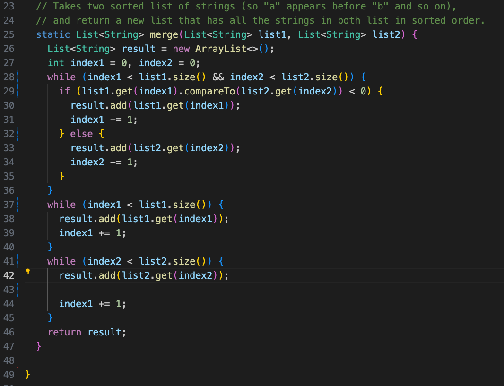

# Lab Report 5

## Part 1
Student: Hello! I am having trouble with my 'merge' method that takes in two lists and merges them in a sorted order, but when I test it using bash test.sh, it always fails and produces the wrong output, and I can't find the reason why. and I was wondering if I could get some help.

My directory structure consists of a lab7 folder containing ListExamples.java, ListExamplesTests.java, test.sh, and a lib folder.

Here are screenshots of my buggy code, failed test code, and the failed tests output:

TA: Hello! Have you checked that all of your variables are properly named and that there are no typos? 

Student: I just checked them and it turns out that on the last while loop I typed index1 instead of index2. I was able to fix it and my tests work. Thank you so much!

## Part 2: What I learned 2nd half of quarter
  The main new thing that I learned from this quarter were bash commands, shell files, vim, and the java debugger. I found that it was really cool that we could write out all the commands that we wanted to run in a file then just call it to run our programs, it really saves a lot of time from always having to search up lengthy commands that I don't remember such as the commands to run JUnit tests. 
  
  Vim is definitely an interesting way to make edits to a file from the terminal, and it is certainly tedious to learn all the commands. However after getting used to some of the basic commands I can see the intentions of the makers of vim. Even so I will stick to using nano because of it's easy to use format.
  
  I knew that most IDEs had debuggers to debug programs, but I never knew that you could do the same thing in the terminal. Now I know how to debug my code if I am ever writing code on a virtual machine. However, because I can't see my code while the debugger is running (or at least have't learned how to yet), I think that I will stick is the VS Code/IDE debugger.

